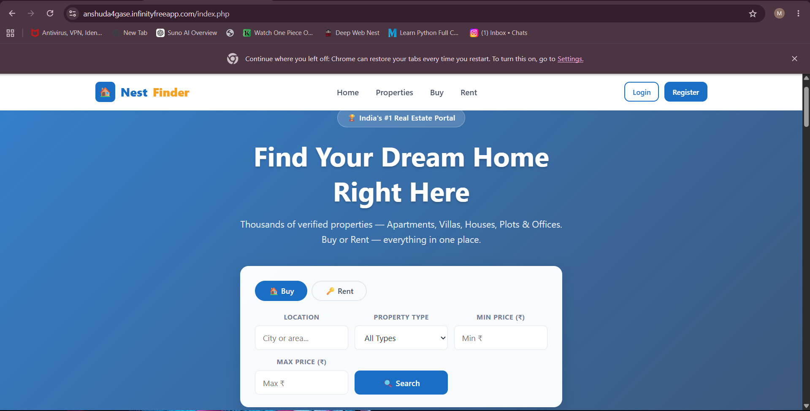
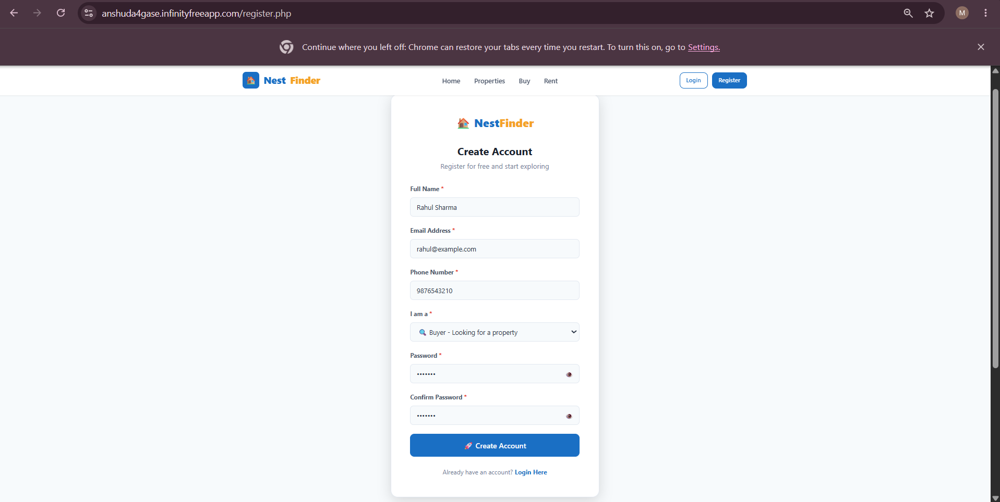
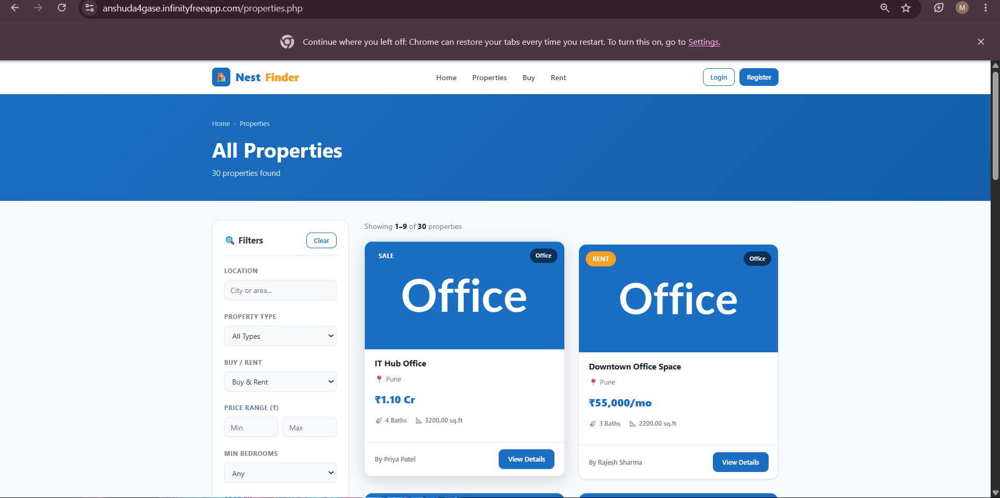
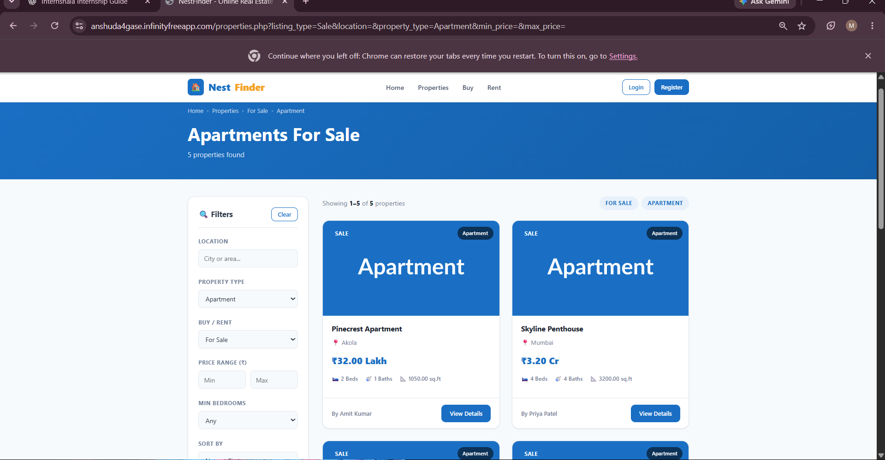
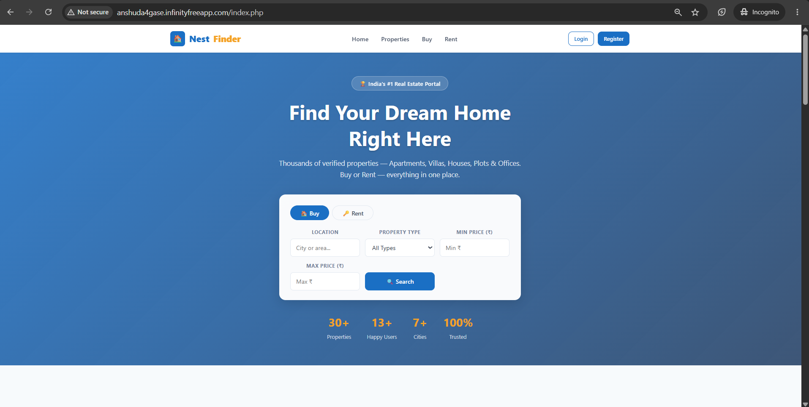

**Student Name:** Anshuda Anil Gase  
**Roll Number:** MLU24F139  
**Division:** C  
**Project Title:** NestFinder - Real Estate Management Web Application  

# NESTFINDER - REAL ESTATE MANAGEMENT WEB APPLICATION

## 1. Project Overview

NestFinder is a web-based Real Estate Management Web Application developed to provide a simple platform for managing and viewing property information.

The application allows users to register and log in, browse available properties, view individual property details, search properties using filters, and manage property-related information.

The application stores data in a MySQL database. PHP is used for server-side processing, while HTML and CSS are used to create the user interface. The application is deployed on InfinityFree hosting.

**Project Title:** NestFinder - Real Estate Management Web Application

---

## 2. Selected Problem Statement

Develop a database-driven Real Estate Management Web Application using HTML/CSS, PHP and MySQL that supports data entry, storage, retrieval, searching and display of property records through a browser, with basic validation and security practices and deployment on a live hosting platform.

---

## 3. Objectives

The main objectives of NestFinder are:

- To provide a simple and user-friendly real estate portal.
- To store users, properties and inquiries in a MySQL database.
- To allow users to view available property records.
- To display detailed information about individual properties.
- To provide a property search/filter feature.
- To implement client-side and server-side validation.
- To use prepared statements for secure database operations.
- To store passwords using password hashing.
- To escape user-controlled output using `htmlspecialchars()`.
- To deploy the application on a live hosting platform.

---

## 4. Technologies Used

### Frontend

- HTML5
- CSS3
- JavaScript

### Backend

- PHP

### Database

- MySQL

### Database Management

- phpMyAdmin

### Hosting

- InfinityFree

---

## 5. Main Features

### 5.1 User Registration

Users can create an account by entering:

- Full Name
- Email
- Phone Number
- Role
- Password
- Confirm Password

The submitted information is validated and stored in the MySQL `users` table.

### 5.2 User Login

Registered users can log in using their email and password. PHP sessions are used to maintain authentication.

### 5.3 Property Listing

The application retrieves property records from MySQL and displays them on the property listing page.

The displayed information includes:

- Property title
- Property type
- Listing type
- Price
- Location
- Area
- Bedrooms
- Bathrooms
- Status

### 5.4 Property Details

Users can select a property and open its details page to view complete information about that property.

### 5.5 Property Search

The application provides a search feature using:

- Location
- Property Type
- Minimum Price
- Maximum Price

The search retrieves matching property records from MySQL.

### 5.6 Property Management

The application supports database-backed property operations including adding records and the corresponding search/update/delete functionality available to authorized users.

---

## 6. Database Design

The project uses a MySQL database named:

`if0_42711554_real_estate_portal`

The main tables are:

### 6.1 `users`

| Column | Type | Key / Constraint |
|---|---|---|
| `user_id` | INT | Primary Key, Auto Increment |
| `name` | VARCHAR | NOT NULL |
| `email` | VARCHAR | NOT NULL, UNIQUE |
| `phone` | VARCHAR | NOT NULL |
| `password` | VARCHAR | NOT NULL |
| `role` | ENUM | NOT NULL |
| `created_at` | TIMESTAMP | NOT NULL |

**Purpose:** Stores registered user account information.

### 6.2 `properties`

| Column | Type | Key / Constraint |
|---|---|---|
| `property_id` | INT | Primary Key, Auto Increment |
| `user_id` | INT | Foreign Key → `users.user_id` |
| `title` | VARCHAR | NOT NULL |
| `type` | VARCHAR | NOT NULL |
| `listing_type` | VARCHAR | NOT NULL |
| `price` | DECIMAL | NOT NULL |
| `location` | VARCHAR | NOT NULL |
| `area` | DECIMAL | NOT NULL |
| `bedrooms` | INT | NOT NULL |
| `bathrooms` | INT | NOT NULL |
| `description` | TEXT | NOT NULL |
| `features` | TEXT | Optional |
| `image` | VARCHAR | Optional |
| `status` | VARCHAR | NOT NULL |
| `created_at` | TIMESTAMP | NOT NULL |

**Purpose:** Stores property information.

### 6.3 `inquiries`

| Column | Type | Key / Constraint |
|---|---|---|
| `inquiry_id` | INT | Primary Key, Auto Increment |
| `property_id` | INT | Foreign Key → `properties.property_id` |
| `user_id` | INT | Foreign Key → `users.user_id`, Optional |
| `name` | VARCHAR | NOT NULL |
| `email` | VARCHAR | NOT NULL |
| `message` | TEXT | NOT NULL |
| `created_at` | TIMESTAMP | NOT NULL |

**Purpose:** Stores inquiries related to properties.

---

## 7. Simple ER Diagram / Table Schema

```text
                 1                    N
        +----------------+     +------------------+
        |     USERS      |     |    PROPERTIES    |
        +----------------+     +------------------+
        | PK user_id     |---->| PK property_id   |
        | name           |     | FK user_id       |
        | email          |     | title            |
        | phone          |     | type             |
        | password       |     | listing_type     |
        | role           |     | price            |
        | created_at     |     | location         |
        +----------------+     | area             |
                               | bedrooms         |
                               | bathrooms        |
                               | description      |
                               | status           |
                               +------------------+
                                        |
                                        | 1
                                        |
                                        | N
                               +------------------+
                               |    INQUIRIES     |
                               +------------------+
                               | PK inquiry_id    |
                               | FK property_id   |
                               | FK user_id       |
                               | name             |
                               | email            |
                               | message          |
                               | created_at       |
                               +------------------+
```

### Relationships

- One user can add multiple properties.
- One property can have multiple inquiries.
- A logged-in user can optionally be associated with an inquiry.

---

## 8. Application Workflow

The basic application flow is:

1. User opens the NestFinder home page in a browser.
2. User selects a required feature such as registration, property listing or search.
3. User enters data in an HTML form.
4. Client-side validation checks basic input requirements.
5. The form sends data to the PHP backend.
6. PHP performs server-side validation.
7. PHP connects to the MySQL database using the separate database configuration.
8. A prepared SQL statement performs the required operation.
9. MySQL stores or retrieves the requested data.
10. PHP generates the resulting HTML response.
11. The browser displays the successful submission, record list, search results or property details.

### Flow Representation

```text
HTML/CSS Form
      ↓
Client-Side Validation
      ↓
PHP Backend
      ↓
Server-Side Validation
      ↓
Prepared SQL Statement
      ↓
MySQL Database
      ↓
PHP Response
      ↓
Browser Output
```

---

## 9. SQL Operations Used

### 9.1 INSERT

`INSERT` is used to add new records into the database.

Examples include:

- Adding a new user.
- Adding a new property.
- Adding a property inquiry.

### 9.2 SELECT

`SELECT` is used to retrieve records from the database.

Examples include:

- Displaying property listings.
- Displaying property details.
- Retrieving database records.

### 9.3 Search

Property search uses `SELECT` queries with filtering conditions such as:

- Location
- Property type
- Minimum price
- Maximum price

### 9.4 UPDATE

`UPDATE` is used to modify existing database records where the corresponding property-management feature is available.

### 9.5 DELETE

`DELETE` is used to remove existing database records where the corresponding property-management feature is available.

---

## 10. Prepared Statements

Prepared statements are used for SQL operations involving user input.

Instead of directly joining user input with an SQL query, placeholders such as `?` are used.

Example:

```php
$stmt = $pdo->prepare("
    SELECT user_id
    FROM users
    WHERE email = ?
");

$stmt->execute([$email]);
```

For inserting a user:

```php
$stmt = $pdo->prepare("
    INSERT INTO users
        (name, email, phone, password, role)
    VALUES
        (?, ?, ?, ?, ?)
");

$stmt->execute([$name, $email, $phone, $hash, $role]);
```

### Why Prepared Statements Are Used

- They help reduce the risk of SQL injection.
- They keep SQL structure separate from user-supplied values.
- They provide safer handling of form input.
- They are suitable for database operations involving user input.

---

## 11. Security Implementation

### 11.1 Server-Side Validation

The application validates submitted information on the server side before database insertion.

For example, registration checks:

- Required fields
- Valid email format
- 10-digit phone number
- Password length
- Matching password confirmation

### 11.2 Password Hashing

Passwords are stored using password hashing rather than plain text.

### 11.3 Output Escaping

User-controlled data displayed in HTML is escaped using:

```php
htmlspecialchars()
```

This helps reduce the risk of HTML/script injection when displaying stored data.

### 11.4 Separate Database Configuration

Database credentials are kept in a separate configuration file instead of being mixed with page presentation code.

### 11.5 Generic Database Error

The public application uses a generic database/service error message rather than exposing detailed database credentials or technical connection information.

### 11.6 Harmless Security Test

A quote-containing test value such as:

`O'Reilly`

was entered as test data.

The value was successfully stored in the database without causing a database error, demonstrating safe handling of the quote-containing input.

---

## 12. Hosted Application

The project is deployed using InfinityFree.

**Live Website:**

http://anshuda4gase.infinityfreeapp.com/

The PHP project files were uploaded to the hosting `htdocs` directory and the MySQL database was configured on the hosted MySQL server.

---

## 13. Test Cases and Output Screenshots


The following screenshots demonstrate the working application.

### Screenshot 1: Home Page
Shows the main page of the application.



### Screenshot 2: Completed Form
Shows the completed form submission.



### Screenshot 3: Successful Insert
Shows the successful insertion of data.


### Screenshot 4: Record List
Shows the list of records stored in the application.



### Screenshot 5: Search Working
Shows the search functionality working successfully.



### Screenshot 6: Security Test
Shows the security testing result.


### Screenshot 7: InfinityFree URL
Shows the deployed application on InfinityFree.



## 14. Conclusion

The NestFinder Real Estate Management Web Application successfully demonstrates a database-driven web application using HTML/CSS, PHP and MySQL.

The application provides user registration and login, property listing, property details, property search and database-backed operations. Prepared statements, server-side validation, password hashing and output escaping are implemented as basic security measures.

The project has also been deployed on InfinityFree, making the application accessible through a public URL.

---

## 15. Declaration of Original Work

I, **Anshuda Anil Gase**, Roll No. **MLU24F139**, Division **C**, declare that the **NestFinder - Real Estate Management Web Application** submitted for academic purposes is my original work.

I have developed and tested the application using the technologies and methods described in this report. Any external resources used for learning or implementation have been used appropriately and are not claimed as original work.
